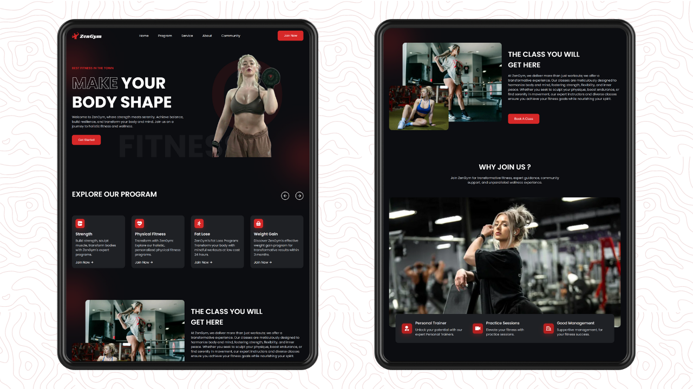
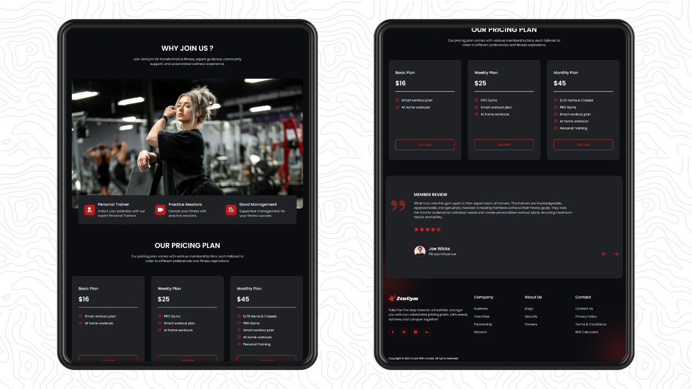
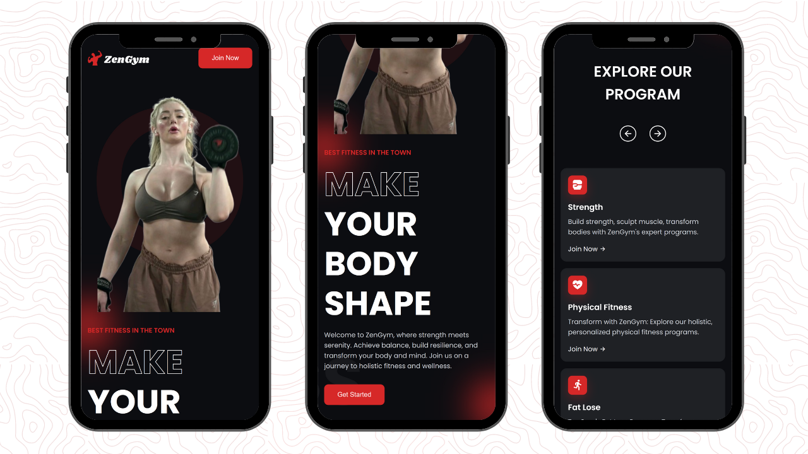
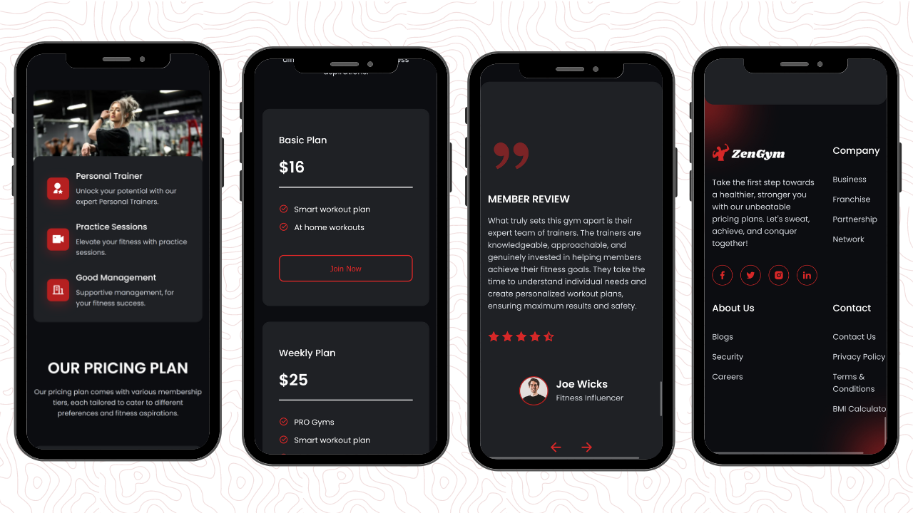

<div align="center">
  


[](https://twitter.com/intent/follow?screen_name=withaarzoo)
[](https://youtu.be/SAu7e09vXoQ)

  <br />
  <br />

  <h2 align="center">Responsive Gym Website</h2>

  Welcome to the Gym Website Project! This project offers a customizable template for creating your gym's online platform to showcase facilities, services, and achievements.

<div>
  <a href="https://youtu.be/3aYed6nMCcM"><strong>➥ Watch Tutorial</strong></a>
  <br>
  <br>
  <a href="https://youtu.be/3aYed6nMCcM"><strong>➥ Download Source Code</strong></a>
</div>

</div>

## Getting Started

To get started with the GYM Project, follow these steps:

1. Clone the repository to your local machine:

```bash
git clone https://github.com/withaarzoo/Responsive-Gym-Website--ZenGym.git
```

2. Open the project in your favorite code editor.

3. Explore the files, and follow along with the tutorial on [YouTube](https://youtu.be/3aYed6nMCcM) for a detailed walkthrough.

## Essential Links

- Google Fonts : [click here](https://fonts.google.com/)
- Remix Icon : [click here](https://remixicon.com/)

## Source Code

You can find the complete source code for the GYM Project on Gumroad:

- [Click here](https://rb.gy/anckws)

## Video Tutorial

Need some extra guidance? Watch our video tutorial on setting up and customizing your portfolio:

- [Responsive GYM Project Tutorial](https://youtu.be/3aYed6nMCcM)

## Connect with Me

If you want to contact me you can reach me at [Twitter](https://twitter.com/withaarzoo).

## Demo Screenshots







---

**Happy Coding!** 🚀
