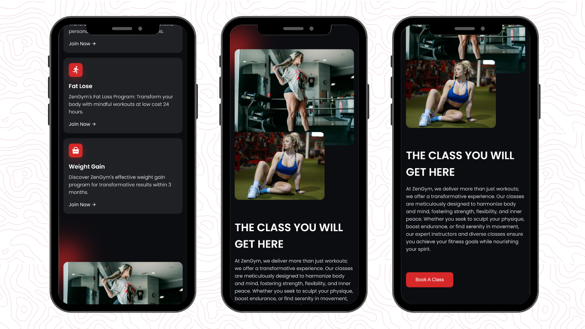

<div align="center">
  


[](https://twitter.com/intent/follow?screen_name=withaarzoo)
[](https://youtu.be/SAu7e09vXoQ)

  <br />
  <br />

  <h2 align="center">Responsive Gym Website</h2>

  Welcome to the Gym Website Project! This project offers a customizable template for creating your gym's online platform to showcase facilities, services, and achievements.

  <a href="#"><strong>➥ Watch Tutorial</strong></a>

</div>

## Getting Started

To get started with the Portfolio Project, follow these steps:

1. Clone the repository to your local machine:

```bash
git clone https://github.com/withaarzoo/Personal-Portfolio-Website-Dani.git
```

2. Open the project in your favorite code editor.

3. Explore the files, and follow along with the tutorial on [YouTube](https://youtu.be/hwvjhS5Ut_k) for a detailed walkthrough.

## Essential Links

- IonIcons : [https://ionic.io/ionicons](https://ionic.io/ionicons)
- Email JS : [https://www.emailjs.com/](https://www.emailjs.com/)

## Source Code

You can find the complete source code for the Portfolio Project on Gumroad:

- [Click here](https://arzoo6.gumroad.com/l/vqkhv)

## Video Tutorial

Need some extra guidance? Watch our video tutorial on setting up and customizing your portfolio:

- [Portfolio Project Tutorial](https://youtu.be/elFHimbsxtQ)

## Connect with Me

If you want to contact with me you can reach me at [Twitter](https://twitter.com/withaarzoo).

## Demo Screenshots





---

**Happy Coding!** 🚀
